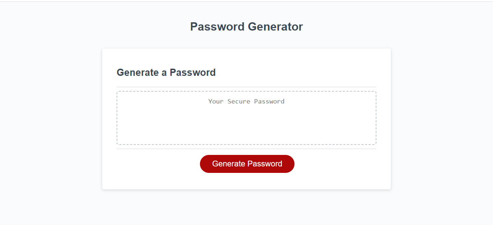

https://zainkhawaja98.github.io/challenge-3-password-generator/
# Password Generator Starter Code

## Description

This website will create a random password that matches the prompts given such as use of uppercase or special characters. It can be used for people who need a secure password with a length between 8-128 characters and can be used for bank logins, emails, or anything that requires a secure password. It solves the problem of reusing the same password for multiple sites or using a password that has a dictionary word which isn't as secure as a string of random numbers, letters, and special characters. I learned how to create variables in javascript and how to create a arrays.

## Installation

N/A

## Usage

In order to use the website, click on generate password and type in the number of characters the password should have with a length between 8-128. Then follow the prompts for what to include in the password such as special, numeric, uppercase, and lowercase characters. The password will be displayed in the text box on the website.

## Credits

N/A

## License

MIT License

Copyright (c) 2022 ZainKhawaja

Permission is hereby granted, free of charge, to any person obtaining a copy of this software and associated documentation files (the "Software"), to deal in the Software without restriction, including without limitation the rights to use, copy, modify, merge, publish, distribute, sublicense, and/or sell copies of the Software, and to permit persons to whom the Software is furnished to do so, subject to the following conditions:

The above copyright notice and this permission notice shall be included in all copies or substantial portions of the Software.

THE SOFTWARE IS PROVIDED "AS IS", WITHOUT WARRANTY OF ANY KIND, EXPRESS OR IMPLIED, INCLUDING BUT NOT LIMITED TO THE WARRANTIES OF MERCHANTABILITY, FITNESS FOR A PARTICULAR PURPOSE AND NONINFRINGEMENT. IN NO EVENT SHALL THE AUTHORS OR COPYRIGHT HOLDERS BE LIABLE FOR ANY CLAIM, DAMAGES OR OTHER LIABILITY, WHETHER IN AN ACTION OF CONTRACT, TORT OR OTHERWISE, ARISING FROM, OUT OF OR IN CONNECTION WITH THE SOFTWARE OR THE USE OR OTHER DEALINGS IN THE SOFTWARE.

---